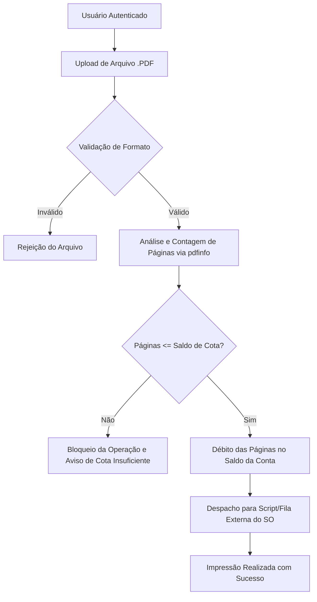

# Sistema IMP (**I**mpressão **M**onitorada de **P**DFs)

Plataforma corporativa para controle, validação e monitoramento de impressões organizacionais com gestão estrita de cotas de páginas e integração com o sistema operacional.

## Introdução

Bem-vindo ao **Sistema IMP**! Esta plataforma foi projetada para simplificar e organizar o envio de impressões corporativas no seu dia a dia, garantindo praticidade, previsibilidade e total controle de recursos.

A partir de uma interface web intuitiva, você envia seus documentos diretamente para as impressoras da organização sem complicações técnicas:

* **Acesso Pessoal e Seguro:** Faça login com suas credenciais de usuário para acessar seu painel e visualizar seu saldo atual de páginas.
* **Envio Padronizado em PDF:** O sistema aceita exclusivamente arquivos no formato **PDF**. Isso assegura fidelidade visual completa — suas fontes, gráficos, margens e layouts serão impressos exatamente como você visualiza na tela.
* **Contagem Automática e Precisa:** Ao selecionar o arquivo, a plataforma analisa instantaneamente a quantidade exata de páginas do documento.
* **Gestão Transparente da Cota Mensal:** Cada usuário dispõe de um limite mensal de páginas. Havendo saldo suficiente, a impressão é liberada imediatamente e as páginas são debitadas. Caso o arquivo ultrapasse o saldo restante, você recebe um aviso na hora com o total de páginas necessário para planejar suas impressões.

## ⚙️ Regras de Negócio e Fluxo Operacional



1. **Acesso Restrito:** Acesso mediante login e credenciais individuais.
2. **Upload Restrito:** Aceite exclusivo de documentos no formato `.pdf`.
3. **Cálculo de Páginas:** O backend inspeciona os metadados do documento em tempo de execução para obter o número exato de páginas.
4. **Validação de Cota Mensal:** Antes de qualquer impressão, verifica se o usuário possui saldo suficiente.
5. **Débito e Despacho:** Havendo cota, o débito é registrado e o arquivo é encaminhado ao script de impressão do sistema operacional; caso contrário, a requisição é cancelada e o usuário é notificado.

---

## 🛠️ Stack Tecnológica

* **Linguagem:** [PHP 8+](https://www.php.net/) (tipagem estrita e recursos modernos)
* **Framework Web:** [CodeIgniter 4](https://codeigniter.com/) (Arquitetura MVC e Services)
* **Utilitários do Sistema Operacional:**
  * `pdfinfo` (`poppler-utils`): Extração rápida e segura da contagem de páginas
  * `qpdf` (Fallback de inspeção de documentos PDF)
  * Scripts Shell / CUPS para interface com as filas de impressão física
* **Segurança:** Sanitização rigorosa de argumentos em chamadas externas de shell (`escapeshellarg` / `escapeshellcmd`).

---

## 📋 Pré-requisitos do Ambiente

Certifique-se de que os seguintes pacotes do Linux estejam instalados no servidor:

```bash
# Instalação das ferramentas de manipulação de PDF (Debian/Ubuntu)
sudo apt update
sudo apt install poppler-utils qpdf
```

Verifique a disponibilidade dos binários:
```bash
which pdfinfo
which qpdf
```
